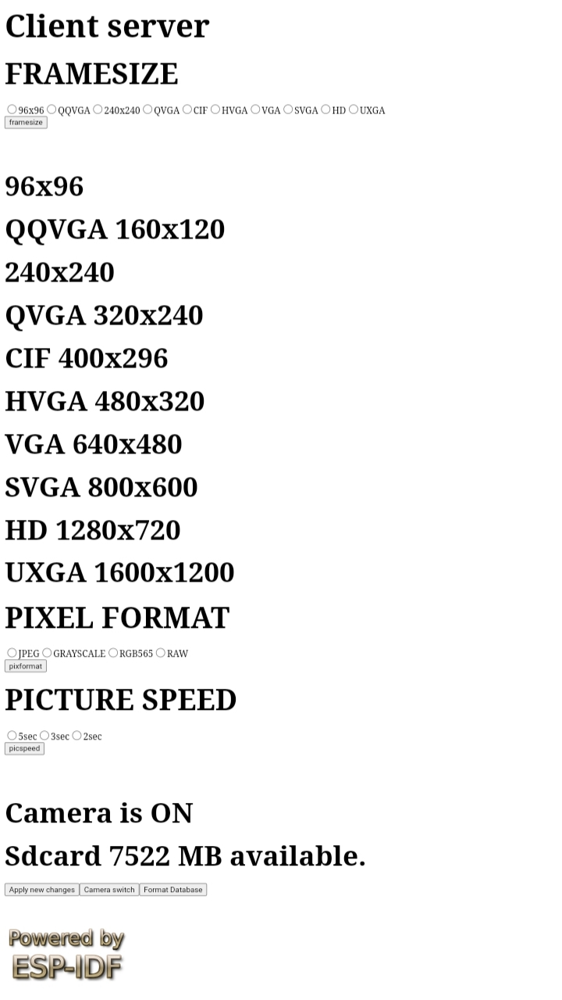

# ESP-IDF Image Collector

After building and uploading code using WIFI component in SMART mode on ESP32_CAM, try to find it's IP in network.

Then use `client.py` to download images by this command `python client.py -ip <IP> d` and if it failed after some while due to wireless disconnections  enter `python client.py -ip <IP> c` to continue downloading.

## Config Camera

While ESP32 is on some parameters are adjustable through web server.

+ `FRAMESIZE` 
> From 96x96 to UXGA 1600x1200
+ `PIXFORMAT`
> JPEG, GRAYSCALE, RGB565 and RAW
+ `PICSPEED`
> Sample rate 1/2,1/3 and 1/5 per second.

## Manually

Receive name list of images by:

`curl http://<IP>/links > links.txt`

Choose your image and download it by:

`curl http://<IP>/01000046.jpg > test.jpg`
